# 🚀 Desafio de Infraestrutura Cloud (AWS), DevOps e Automação

Este repositório contém a solução completa que desenvolvi para o desafio técnico. O projeto entrega um ambiente funcional na AWS, com foco em segurança, automação total (IaC) e monitoramento, aplicando práticas modernas de mercado.

---

## 📋 1. Arquitetura da Solução

O desenho da infraestrutura prioriza a **segurança dos dados** e a **alta disponibilidade**. A estratégia central foi isolar os recursos críticos em camadas de rede distintas.

### 🏗️ Estrutura de Rede (AWS VPC)

A rede foi provisionada do zero via Terraform na região `us-east-1` (N. Virginia), organizada da seguinte forma:

- **Rede Pública (Public Subnet - `10.0.1.0/24`):**
  - Hospeda a **Aplicação (Node.js)**, o **Proxy Reverso (Nginx)** e o **Grafana**.
  - Possui um **Internet Gateway** para entrada de tráfego e um **Elastic IP** para garantir estabilidade de DNS.

- **Rede Privada (Private Subnet - `10.0.2.0/24`):**
  - Dedicada exclusivamente ao **Banco de Dados (PostgreSQL)**.
  - **Segurança:** Sem endereço IP público, impedindo qualquer acesso direto da internet.
  - **Conectividade:** Utiliza um **NAT Gateway** para saída segura (atualizações e backups), sem expor a porta de entrada.

> **Nota Técnica:** Em um cenário corporativo crítico, a boa prática seria separar fisicamente a aplicação do sistema de monitoramento. Isso garantiria a observabilidade mesmo em casos de esgotamento de recursos do servidor principal. Para este desafio, optei pela consolidação visando eficiência de recursos.

### 🔄 Fluxo de Dados

1. Acesso ao domínio `provadouglas.uzzipay.com` (Cloudflare).
2. Requisição chega à AWS via Elastic IP.
3. **Nginx** (Proxy Reverso) recebe na porta 80/443 e encaminha para a API.
4. Aplicação consome o Banco de Dados através da rede privada.

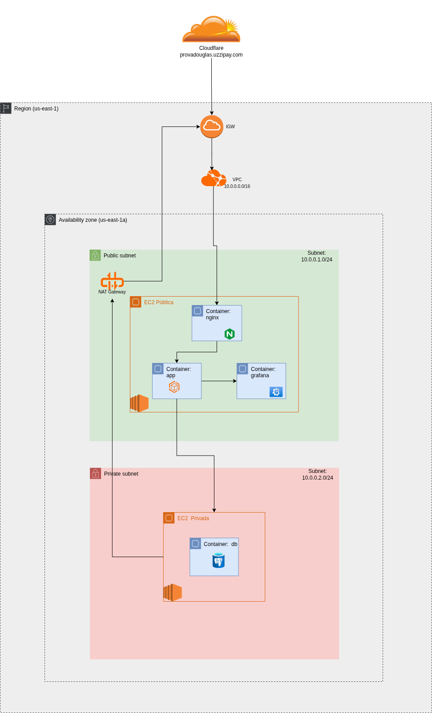  

---

## 🛠️ 2. Instalação e Configuração

### Pré-requisitos

- Conta AWS ativa.
- Terraform instalado.
- Azure DevOps com agente configurado (Self-Hosted).

### Passo 1: Provisionamento (Terraform)

Toda a infraestrutura é gerenciada como código (IaC).

alterar aqui com o codigo bash

**Automação de Boot:** Utilizei scripts `user_data` para que as instâncias já iniciem com Docker e AWS CLI instalados e configurados, eliminando etapas manuais pós-provisionamento.

### Passo 2: Pipeline CI/CD (Azure DevOps)

O deploy é gerenciado pelo `azure-pipelines.yml`:

- **Build:** Gera a imagem Docker e envia ao Docker Hub.
- **Deploy Dinâmico:** O pipeline consulta o Terraform para obter o IP atual do servidor e realiza a atualização dos containers via SSH automaticamente.

---

## 💡 3. Decisões Técnicas e Justificativas

| Decisão | Motivo da Escolha |
|-------|--------------------|
| **IAM & PoLP** | Adoção do **Princípio do Menor Privilégio (PoLP)**. Em vez de chaves de acesso fixas (`AWS_ACCESS_KEY`), atribuí **IAM Roles** às instâncias com permissões granulares (apenas escrita de logs no CloudWatch e leitura de parâmetros necessários), garantindo segurança e rotação automática de credenciais. |
| **Estratégia SSL (Self-Signed)** | Para garantir criptografia ponta a ponta (Cloudflare -> EC2) sem a complexidade de validação de DNS (Certbot) durante o boot efêmero da máquina, implementei a geração automática de um certificado **Self-Signed via OpenSSL** no script de inicialização (`user-data`). O Nginx força HTTPS internamente, enquanto o Cloudflare garante o SSL confiável na borda. |
| **NAT Gateway** | Optei pelo uso do **NAT Gateway** gerenciado pela AWS. Embora tenha um custo maior e não seja Free Tier, a escolha se deve à estabilidade e segurança superiores em comparação a uma "NAT Instance" manual, aproveitando os créditos disponíveis na conta. |
| **Docker Compose** | A containerização total do ambiente (App, Banco, Proxy, Monitoramento) garante que o comportamento seja idêntico entre o ambiente de desenvolvimento e produção. |
| **Agente Self-Hosted** | Devido à fila de espera nos agentes gratuitos da Microsoft, configurei um agente na minha própria infraestrutura para garantir agilidade e controle nos deploys. |

---

## 🛡️ 4. Backup e Segurança

### Estratégia de Disaster Recovery

Implementei duas camadas de proteção para os dados:

1.  **Backup Lógico (Off-site):** Script automatizado no `crontab` gera dumps do banco a cada 12 horas e envia para um **Bucket S3**.
2.  **Backup Físico (Snapshot):** Configuração do AWS Data Lifecycle Manager (DLM) para snapshots automáticos do volume EBS.
    - **Política:** Execução a cada 12h (início às 09:00 UTC).
    - **Retenção:** Mantém os últimos 3 snapshots (janela de ~1.5 dias) para otimização de custos.

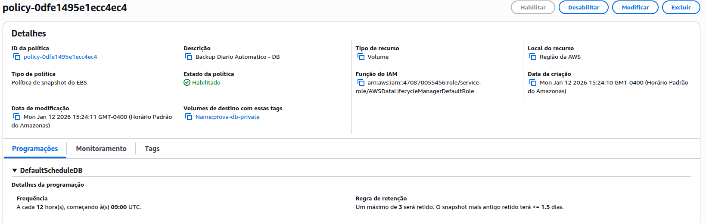

### Segurança de Rede (Security Groups)

O controle de acesso ao banco de dados não é feito por IP, mas por **Referência de Grupo**. O Security Group do banco aceita conexões na porta 5432 apenas se a origem for o `prova-public-sg` (Grupo da Aplicação). Isso garante isolamento total independente do endereçamento de rede.

---

## 📊 5. Observabilidade

A estratégia de monitoramento combina visualização gráfica e diagnóstico em tempo real.

### A. Grafana + CloudWatch
Monitoramento centralizado via **Grafana** (porta 3001), integrado nativamente via IAM Role.

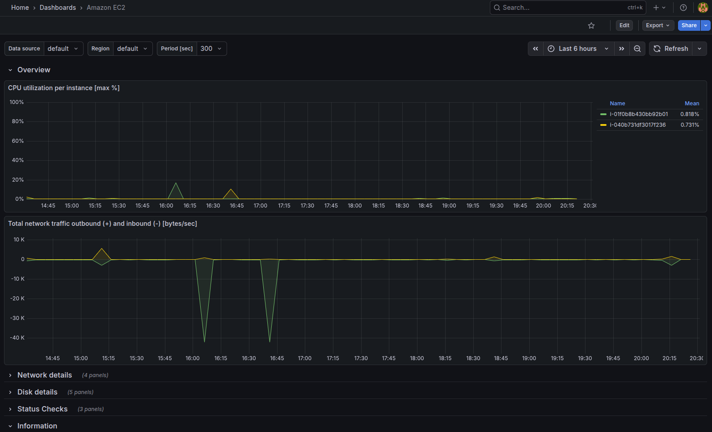

### B. Diagnóstico via Terminal
Para validação profunda de recursos, utilizo ferramentas de CLI (`docker stats` e `htop`) diretamente na instância.

- Docker Stats - EC2 Pública: 

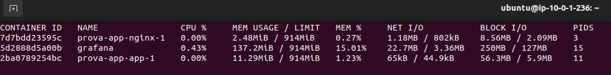

- htop - EC2 Pública: 

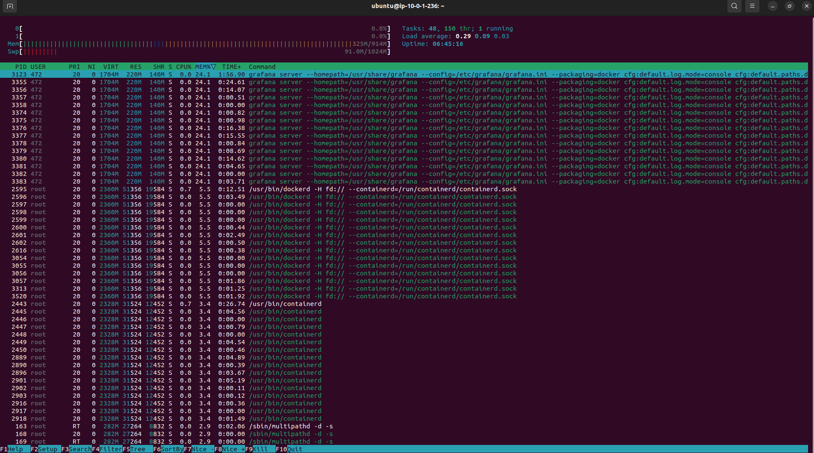

- Docker Stats - EC2 Privada: 

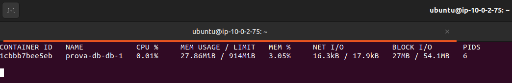

- htop - EC2 Privada: 

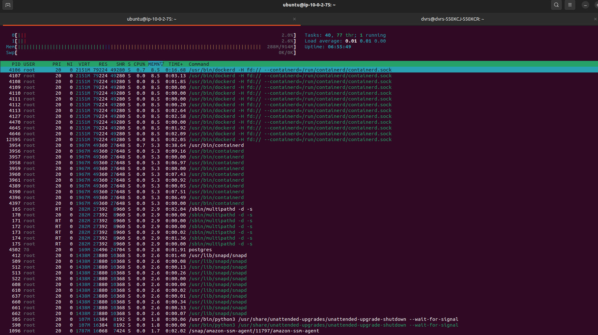

---

## 🖼️ 6. Evidências de Entrega

- **A. Aplicação Rodando:** API respondendo com sucesso e conectada ao banco privado.
  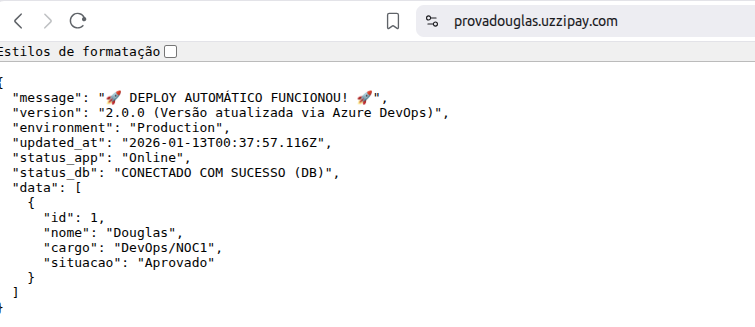

- **B. Pipeline de Sucesso:** Execução completa no Azure DevOps.
  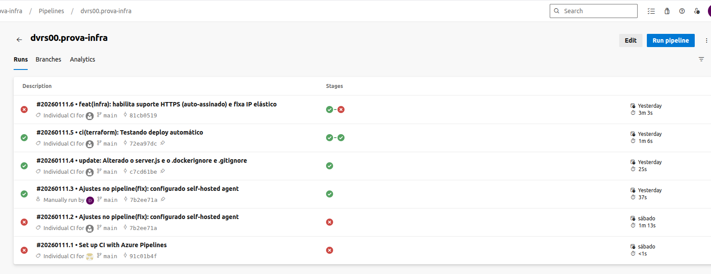

- **C. Backup no S3:** Arquivos `.sql` gerados no bucket.
  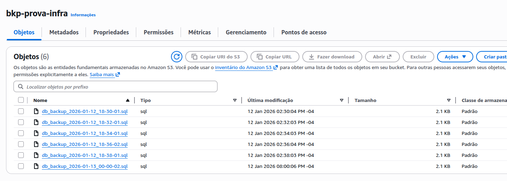

- **D. Containers Ativos - EC2 Pública:** Output do comando `docker ps`.
  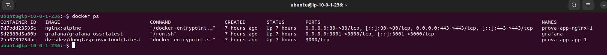

- **E. Containers Ativos - EC2 Privada:** Output do comando `docker ps`.
  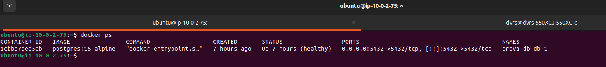

---

## ⚠️ Nota sobre Custos (FinOps)

O dashboard de custos do Grafana não populou dados gráficos consistentes. Acredito que o motivo mais provável seja o *delay* padrão de processamento do AWS Cost Explorer (que pode levar até 24h) somado aos valores muito baixos (micropagamentos) gerados durante o curto período de testes.

Como evidência de controle e uso do Free Tier (exceto NAT Gateway), segue o report direto do **AWS Billing Console**:

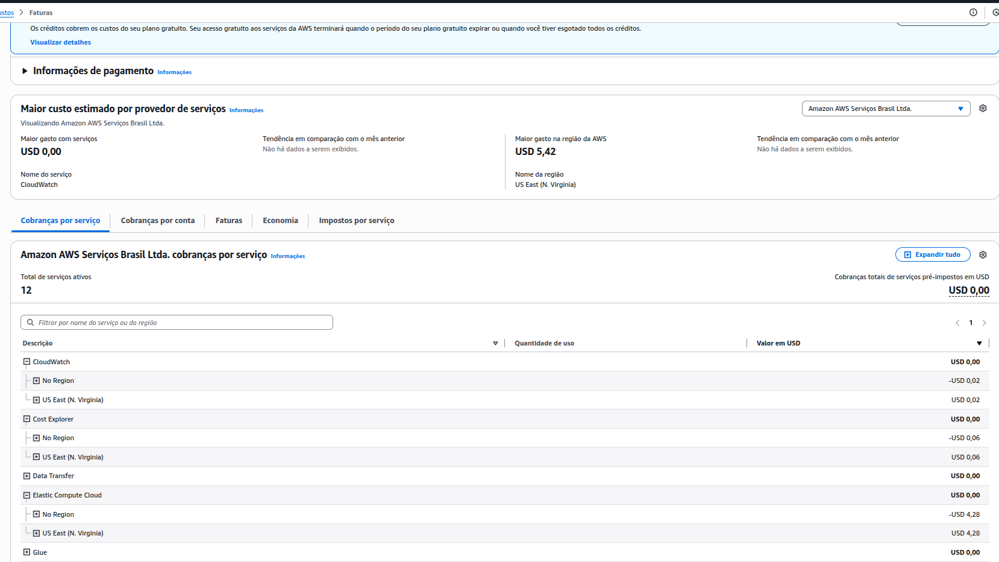
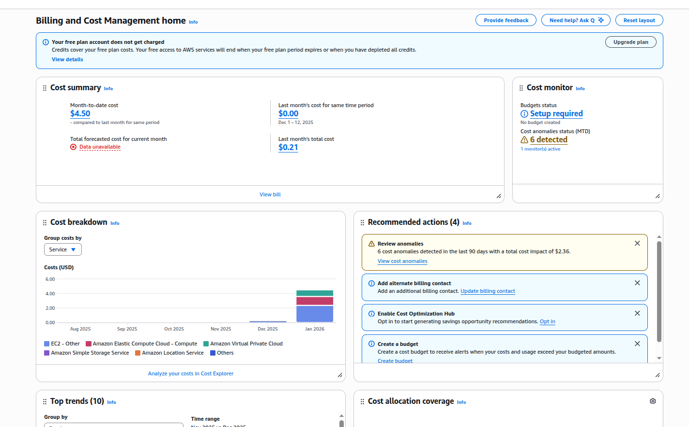

---